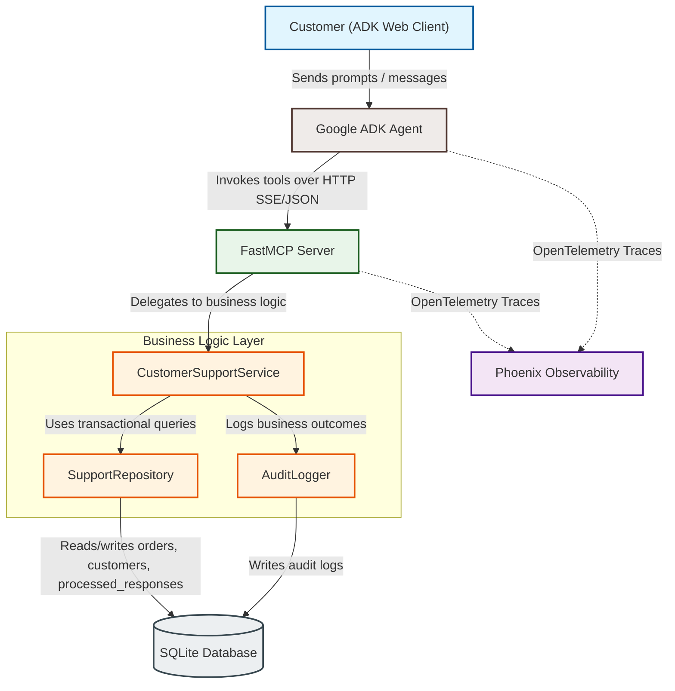
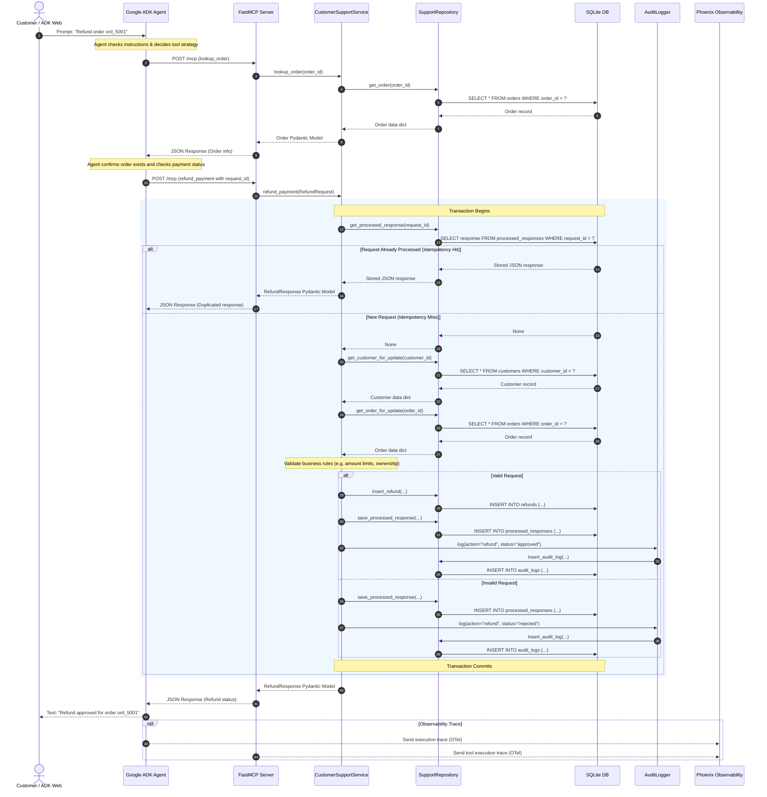
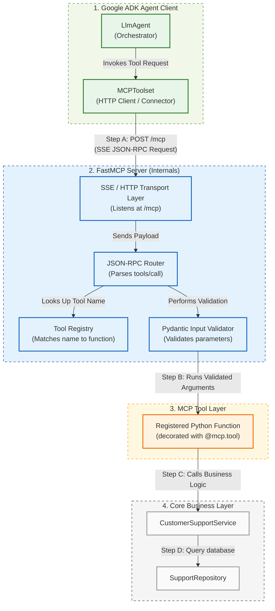

# MCP Customer Support Demo

This project is a teaching demo for production practices for MCP tool design.

The use case is a simple customer support workflow for broken or returned products. A customer can ask to look up an order, receive store credit, request a refund, or review previous support actions. The business logic is exposed through MCP and consumed by a Google ADK agent.

The main teaching point is this: **MCP tools should be safe, typed, well-described wrappers around real business logic.** The agent should use tools; it should not contain the business rules itself.

## Architecture At A Glance

The project uses a clean multi-tiered architecture where business rules are decoupled from the Model Context Protocol (MCP) interface:

### System Architecture Flow



### Sequence Flow Diagram

Here is a typical execution sequence when a customer requests a transaction refund or store credit adjustment:



### Internal Component Flow (Google ADK & FastMCP)

#### What is FastMCP?
**FastMCP** is a high-level Python framework designed to simplify the creation of Model Context Protocol (MCP) servers. Rather than managing low-level JSON-RPC protocol parsing, schema creation, and network transport details manually, FastMCP:
1. **Registers Python functions** as tools using simple decorators (e.g., `@mcp.tool`).
2. **Generates JSON Schemas** automatically from Python type hints and Pydantic model annotations.
3. **Manages Transports** (such as HTTP Server-Sent Events / SSE or Standard Input/Output / Stdio) to receive and reply to messages.

#### Component Interaction & Invocation Order

When the Google ADK Agent decides it needs to use a tool, the invocation flows through the following components:




## Run The Demo


### 1. Start Phoenix

Start Phoenix first so traces are captured while you run the MCP server and ADK agent:

```bash
uv run phoenix serve
```

Open Phoenix at:

```text
http://localhost:6006
```


### 2. Start The MCP Server

In a second terminal, from the repository root:

```bash
uv run src/customer_support/mcp/server.py
```

The MCP server runs as Streamable HTTP at:

```text
http://127.0.0.1:9000/mcp
```


### 3. Start ADK Web

In a third terminal, from the repository root:

```bash
cd src
adk web 
```

Select the `customer_support` agent in ADK Web.

### 4. Use Demo Prompts

Open [DEMO_PROMPTS.md](DEMO_PROMPTS.md) and copy/paste the prompts into ADK Web.

Recommended flow:

1. Basic lookup
2. Store credit preferred
3. Explicit refund
4. Audit logs
5. Idempotency retry
6. Guardrail/error case


## Project Structure

```text
src/customer_support/
  core/
    models.py          Pydantic request, response, and domain models
    database.py        SQLite schema creation, connection setup, seed data
    repository.py      All SQL and database persistence operations
    support_service.py Business rules for lookup, store credit, refund
    audit.py           Business audit log helpers
  mcp/
    server.py          FastMCP server entrypoint and tool wrappers
  adk_client/
    agent.py           Google ADK root agent and MCP toolset wiring
    prompts.py         Agent instruction prompt
    run_demo.py        Scripted ADK + MCP demo scenarios
```


## Important Practices Demonstrated


### 1. Keep Business Logic Out Of MCP

The business rules live in `core/support_service.py`.

The MCP layer in `mcp/server.py` only:

- validates input
- delegates to the service
- returns structured response models
- provides tool metadata

This keeps the same business layer reusable from ADK, LangGraph, tests, or any future client.

### 2. Use Typed Request And Response Models

Pydantic models make the tool contract explicit. The agent receives predictable structured outputs instead of raw database rows.

Examples:

- `RefundRequest`
- `RefundResponse`
- `StoreCreditRequest`
- `StoreCreditResponse`
- `AuditEntry`


### 3. Write Tool Descriptions For LLM Behavior

Tool descriptions are part of the product. They guide the agent on when to use a tool.

For example:

- `add_store_credit` says store credit is preferred, fast, and non-destructive.
- `refund_payment` says to use refunds only when the customer explicitly asks for money back.
- Mutating tools explain that retries are safe when the same `request_id` is reused.


### 4. Make Mutating Tools Idempotent

Store credit and refund operations require a `request_id`.

Before processing, the service checks whether that `request_id` already exists. If it does, the previously stored response is returned exactly as before.

This prevents duplicate refunds or duplicate credits when an agent retries a call.

### 5. Separate Business Audit From Observability

SQLite `audit_logs` answer business questions:

- What action happened?
- For which customer/order?
- What amount?
- Was it approved, issued, or rejected?

Phoenix answers engineering questions:

- What did the agent do?
- Which tools were called?
- What were the inputs and outputs?
- How long did calls take?
- Where did errors happen?

Both are useful, but they serve different purposes.

### 6. Keep Tool Outputs Concise

The tools return response models, not raw rows. This makes outputs easier for LLMs to consume and safer to expose.

### 7. Test The Tool Contract Independently

The deterministic tests verify business and tool behavior without depending on the LLM making good decisions.

This separates software correctness from agent behavior.


## Closing idea:

> Good MCP design is not just exposing functions. It is exposing safe, typed, well-described capabilities that agents can use reliably.

